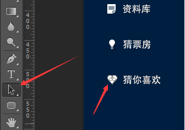
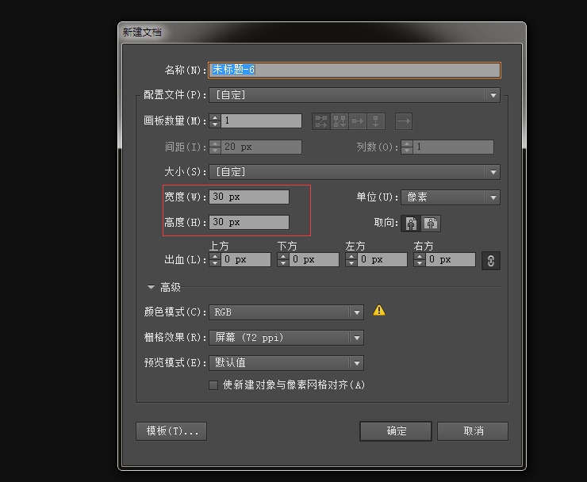
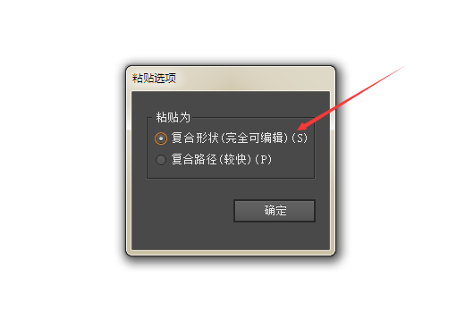
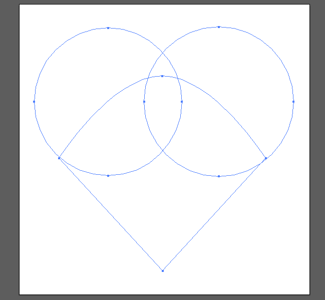
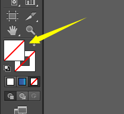
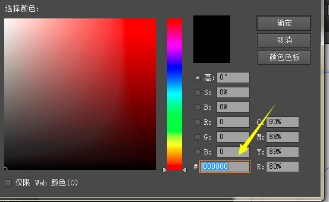
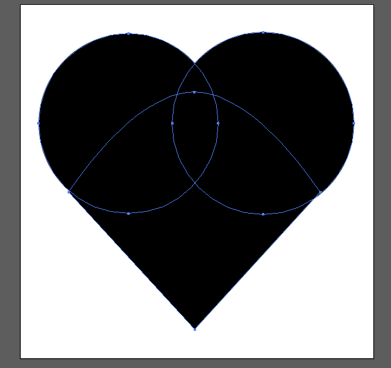
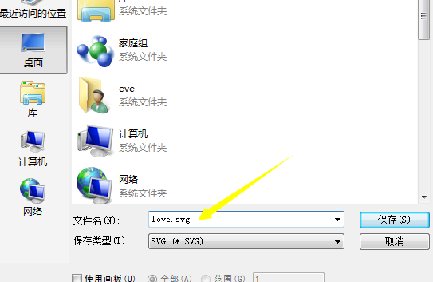
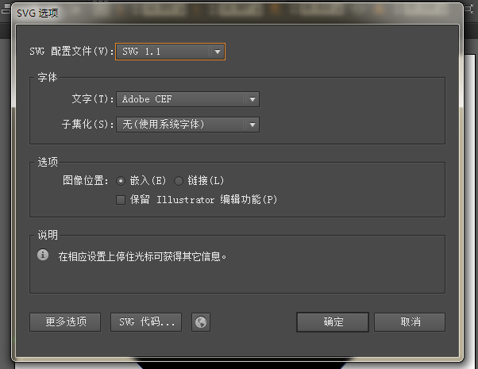
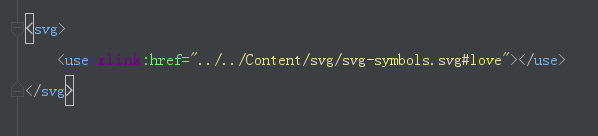

 作为一名伪前端人员砸是不能对所有设计工具都运用自如的，所以这里教大家一个非常简单的方法借用Photoshop来创建SVG格式的矢量图，以便于在开发页面中适用不同终端，而且还很方便的对其进行修改（颜色、大小等），所以当你有icon要在网页中用到时请试着用svg来啊，至少不用麻烦设计师设计多套icon，同时也方便了自己。

 **1、打开Photoshop用形状工具画个形状出来**

 这里我的设计稿中UI已经帮我画了个出来，我就不画了

 **2、用选择形状工具选取我们画的形状，如下图**

左边是选择形状工具，右边是用工具点击后的样子，这里可能一不小心就会变成编辑的状态，在选择了形状的状态下我们复制一下这个形状`ctrl+v`
 

  <!--more-->

 **3、打开AI，创建画布 `ctrl+n`,这里大小不要太大，30就差不多了 **

 

 **4、 `ctrl+v` 选择第一个可以编辑的 **

 
 黏贴后的样子，如下图
 

 **5、点击第一个前景色，将它设置成黑色的 **

 
 这里不选择黑色的话，后面通过css的fill就改不了颜色了，生成的svg会填充fill色值，那时需要手动删除才能通过css更改
 

 **6、这时可以看到我们的svg颜色也跟着变了 **
 要的就是这效果
 

 **7、保存，选择svg格式 **
 

 **9、这里默认就好 **
 
 是不是so easy!! 天空一片晴朗哇

 **9、最后这是用gulp-symbols的方法将多个svg合并，然后在页面中的调用方法 **
 
也可以直接复制svg代码在页面中应用，这里呢只是介绍了如何借助PS来创建我们所需要的svg
 
额。。本文截图太多了，好像也显得有点啰嗦，不管了...宝宝睡觉去！！