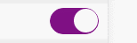

 关于用css模仿apple风格的开关按钮效果，经常会在移动端中用到，这次也用到了就想到写篇关于这个按钮的博客吧

 我们先来看看效果

 


 开与关的效果没有用js，而是利用**input:checked**的状态

 废话不多话，我们来上一段代码吧
### HTML
```
      <span class="switch"><input type="checkbox"/><em></em></span>
```


  <!--more-->


### CSS

```
    input{
        -webkit-appearance: none;
        outline: none;
    }
     .switch{
          position: relative;
          display: inline-block;
          height: 30px;
          width : 55px;
      }
      //用了一个input盖在按钮的上方让背景为透明的 当input为checked时改变容器背景与小圆圈的位置
      .switch input {
          position: absolute;
          width: 100%;
          height: 100%;
          z-index: 1;
          background-color: transparent; //如果没有这个的话 点击关的时候会有一层黑的
      }
      //这里是紫色的容器
      .switch em {
          width: 55px;
          border: 1px solid #7f1084;
          background-color: #7f1084;
          border-radius: 30px;
          transition: all .3s ease-out; //过渡的动画
      }
      //按钮内的小圆圈
      .switch em:after{
          content: '';
          position: absolute;
          width: 27px;
          height: 27px;
          background-color: #fff;
          border-radius: 50%;
          right: 0;
          top: 0;
          transition: all .3s ease-out;
          }
       // 当点击input时的交互
      .switch input:checked+em{
            background-color:#f5f5f5;
            border-color:#ddd;
          }
       .switch input:checked+em:after{
             right:26px;
             box-shadow:1px 1px 3px #ddd;
          }
```
最后在上一张效果图
   