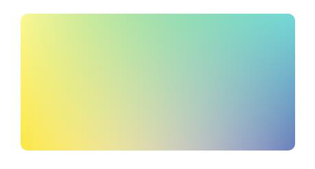

利用css渐变实现混合模式背景图


```
<div></div>
```

```
div{
margin:50px auto;width: 400px;height: 200px;border-radius:10px ;
 background: linear-gradient(#15b56d, transparent),
   linear-gradient(90deg,#fce645, transparent),
   linear-gradient(-90deg,#697ebb, transparent);
     background-blend-mode: screen;
}
```
> 主要是用到了渐变与背景混合模式`background-blend-mode;`有多个属性值大致跟Photoshop面板中的一样