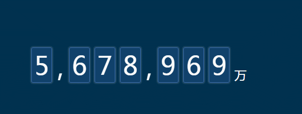

前几天`@歪闹`说想换个类似 http://www.dengzhr.com 这个风格的博客，然后进去瞄了几眼看到一篇关于数字线性变化的动画文章，美女是用js写的自己封装的插件(羡慕js棒棒的美女),然后感觉css也可以写，不过没有她的那么方便吧

来看效果，当然还是少不了几行js

我们来看看具体的实现方式吧

<!--more-->

####  html
```
  // 其中span是从0-9所需要的动画数字  data-num是所显示的数据
  // 有多少位数字就有多少个num-bg元素，就是html有点略多

<div class="digital-box">
            <div class="num-bg">
              <div class="num" data-num="5">
                <span>0</span>
                <span>1</span>
                <span>2</span>
                <span>3</span>
                <span>4</span>
                <span>5</span>
                <span>6</span>
                <span>7</span>
                <span>8</span>
                <span>9</span>
            </div>
            </div>
            <div class="dot">,</div>
            <div class="num-bg">
              <div class="num" data-num="6">
                <span>0</span>
                <span>1</span>
                <span>2</span>
                <span>3</span>
                <span>4</span>
                <span>5</span>
                <span>6</span>
                <span>7</span>
                <span>8</span>
                <span>9</span>
            </div>
            </div>
            <div class="num-bg">
              <div class="num" data-num="7">
                <span>0</span>
                <span>1</span>
                <span>2</span>
                <span>3</span>
                <span>4</span>
                <span>5</span>
                <span>6</span>
                <span>7</span>
                <span>8</span>
                <span>9</span>
            </div>
            </div>
            <div class="num-bg">
              <div class="num" data-num="8">
                <span>0</span>
                <span>1</span>
                <span>2</span>
                <span>3</span>
                <span>4</span>
                <span>5</span>
                <span>6</span>
                <span>7</span>
                <span>8</span>
                <span>9</span>
            </div>
            </div>
            <div class="dot">,</div>
            <div class="num-bg">
              <div class="num" data-num="9">
                <span>0</span>
                <span>1</span>
                <span>2</span>
                <span>3</span>
                <span>4</span>
                <span>5</span>
                <span>6</span>
                <span>7</span>
                <span>8</span>
                <span>9</span>
            </div>
            </div>
            <div class="num-bg">
              <div class="num" data-num="6">
                <span>0</span>
                <span>1</span>
                <span>2</span>
                <span>3</span>
                <span>4</span>
                <span>5</span>
                <span>6</span>
                <span>7</span>
                <span>8</span>
                <span>9</span>
            </div>
            </div>
            <div class="num-bg">
              <div class="num ceshi" data-num="9">
                <span>0</span>
                <span>1</span>
                <span>2</span>
                <span>3</span>
                <span>4</span>
                <span>5</span>
                <span>6</span>
                <span>7</span>
                <span>8</span>
                <span>9</span>
            </div>
            </div>
            <div class="dot dot2">万</div>
        </div>
```
#### css
```
body{ background-color: #00314f;}
.digital-box {
    display: inline-block;
    height: 140px;
    margin:100px;
    font-size: 52px;
    text-align: center;
    color:#fff;
}

.digital-box .num-bg {
    float: left;
    width: 40px;
    height: 70px;
    margin: 20px 5px 50px;
    background: rgba(56,106,171,.3);
    border-radius: 3px;
    border: 1px solid #386aab;
    box-shadow: 0 0 3px 2px #2c5570;
    overflow: hidden;
}

.digital-box .num {
    position: relative;
    top: 0;
    width: 40px;
    line-height: 70px;
    -webkit-transition: top ease-out .5s;
    transition: top ease-out .5s;
}

.digital-box .num span {
    float: left;
    width: 100%;
}

.digital-box .dot {
    float: left;
    width: 25px;
    margin-top: 25px;
}

.digital-box .dot3 {
    font-size: 78px;
    margin-top: 3px
}

.digital-box .dot2 {
    font-size: 25px;
    margin-top: 60px;
    margin-left: 5px
}
```
#### js
```
       $(function(){
           $(".num").each(function(){
            var _val = $(this).data('num');
            $(this).css({
                "top":-(_val*70)+'px',
                "transitionDuration" :_val*.3+'s'
            })
        })
       })
```
附上demo地址：http://output.jsbin.com/henawarege