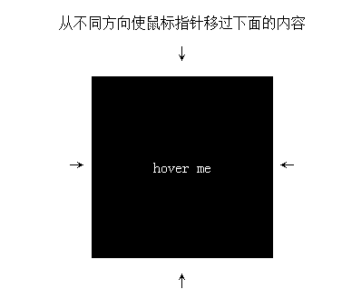

昨天某技术群讨论的一道css题挺不错的，说的是同一个div鼠标从不同方向划过展示不同的效果，

效果预览如下：
 

工具录制的gif图，有些卡顿
浏览地址看这 ：http://output.jsbin.com/qixomayeqi

第一眼看这感觉是js实现的吧，后群里集思广益，发现css也可以实现的，方法就是用了四个div定位在容器的四边，当你鼠标滑过时让div显示出来就行，挺有意思的

让我们看看是怎么实现的,来点击more查看详情吧


  <!--more-->

### css代码如下


```
body{text-align: center;}
.box{
  position: relative;
 display: inline-block;
  vertical-align: middle;
  width: 200px;
  height: 200px;
  text-align: center;
  background-color: #000;
  color:#fff;
  overflow: hidden;
}

.box-contact{
  position: absolute;
  width: 100%;
  height: 100%;
  line-height: 200px;
}

.box-hover{
  position: absolute;
  z-index: 1;
  width: 100%;
  height: 100%;
  opacity: 0;
  transition: all .3s ease;
}
.box-hover:first-child{
  background-color: #f00;
  top:-90%;
}
.box-hover:nth-child(2){
  background-color: #0f0;
  left:90%;
}
.box-hover:nth-child(3){
  background-color: #00f;
  top:90%;
}
.box-hover:nth-child(4){
  background-color: purple;
  left:-90%;
}
.box-hover:hover{
  opacity:1;
  top:0;
  left:0;
}
```

### html如下

```

   <p>从不同方向使鼠标指针移过下面的内容</p>
   <p>↓</p>
   <span>→ </span>
<div class='box'>
  <div class="box-hover">1</div>
  <div class="box-hover">2</div>
  <div class="box-hover">3</div>
  <div class="box-hover">4</div>
  <div class="box-contact">hover me</div>
</div>
  <span> ←</span>
  <p>↑</p>


```
