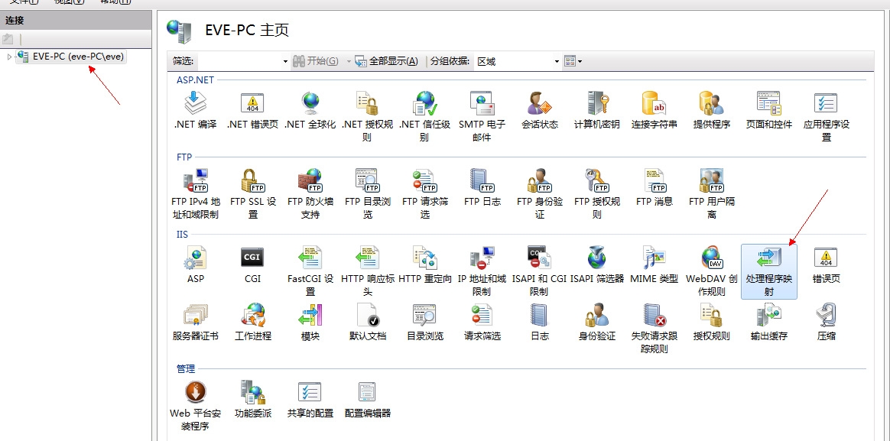
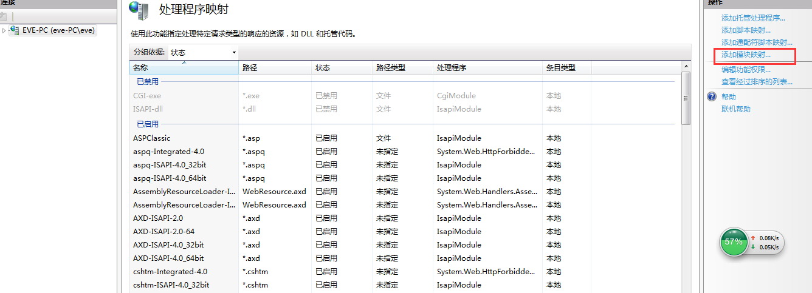
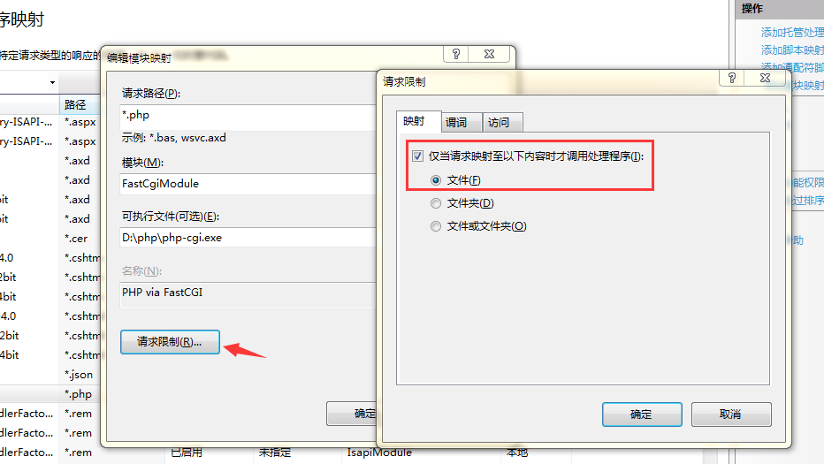
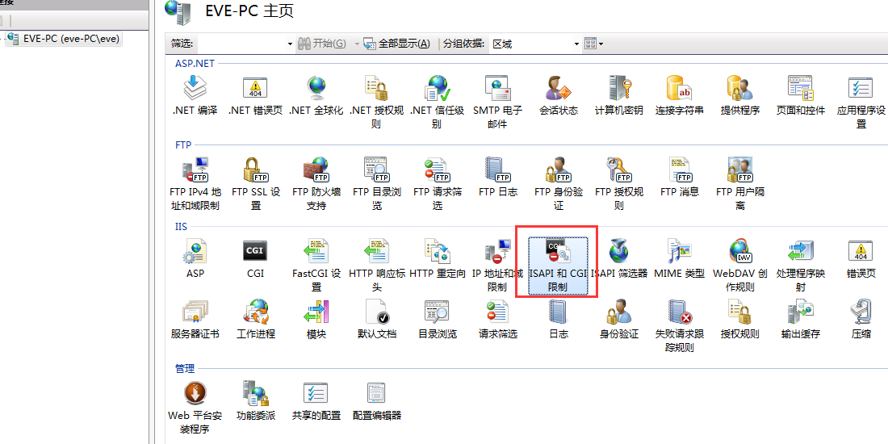
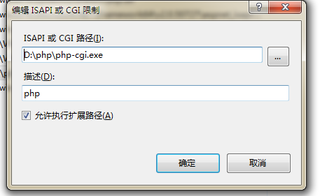
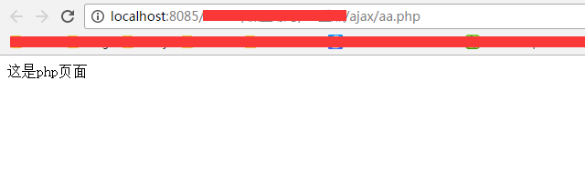

 一直想练习ajax做点demo，陆陆续续的也看了挺多教程，但一直没实战下，今天又重温一遍视频，首先讲的是部署php环境搭建服务器，视频中老师用阿帕奇集成环境，我下载这个也不想下载，之前同事有过在iis部署php的方法，但我都忘了，今天自己又部署了一遍，结果竟然可以运行php文件，哈~~，因为部署成功了，所以我决定把过程记录下来（开心的一刻）。


 首先在网上看了些博客，关于怎样在iis中配置部署php环境的相关文章，来，跟我着我一步一步往下走！！


 ### 第一步：官网下载php文件包 http://windows.php.net/download/

 我这里下载的版本是 php-5.6.3 ，看人家是下载这个，我就下载了这个~~

  将下载的文件解压到一个盘里，我解压的是在D，新建了个php文件夹 `D:\php`

 ### 第二步：将php下的`php.ini-development`这个文件拷贝一份重命名`php.ini`

### 第三步：配置我们重命名的php.ini文件

 注：改了哪行就把哪行前面的分号去掉
* ①修改扩展路径：extension_dir = "D:\PHP\ext" （这里写自己的实际路径）
* ②时区：date.timezone = asia/shanghai （也可以是beijing,默认是空的啥也没有）

   <!--more-->


* ③fastcgi.impersonate=1 默认为0，如果使用IIS，你需要开启为1 （所以我们设为1就好）
* ④cgi.fix_pathinfo=1
* ⑤cgi.force_redirect=0 默认为1，如果你使用IIS，需要将其关闭为0
* ⑥session存储路径，如：session.save_path = "D:\server\web\session" (这里写一个保存session的路径)

### 第四步: 设置我们的IIS（安装过程可自行度娘谷哥）
  首先打开iis,我们找到处理程序映射,并打开它
  

  然后在右侧，我们选择添加模块映射
  

   把相应的信息填上，module选择Fast..,然后下一框选择自己解压的php文件夹中的php-cgi.exe,填完后在请求限制中我们勾选上文件类型，最后确定。
   

   确定后我们返回主界面，点击ISAPI和CGI限制，在点击右侧添加，路径为D:\php\php-cgi.exe，描述可写php，允许执行扩展路径，确定。
      
      

到这为止，我们的配置就完成了。
### 第五步: 我们来测试下是否成功了
在站点下建个php页面，我们起名叫aa.php,页面中输入
```
<?php
  echo '这是php页面'
?>

```
打开localhost:8085/ajax/aa.php(这里是自己配置的端口)




是不是可以成功输出啊，哈！继续努力~~