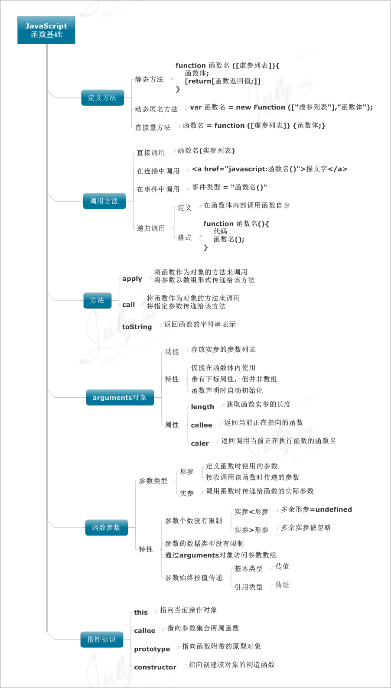

学习的道路就是要不断的总结归纳，好记性不如烂笔头，so，下面将 po 出我收集的 11 张 javascript 相关的思维导图（非原创）。

 知识，没有进阶的技巧。
只是，万丈高楼平地起；只是，千里之行始于足下；只是，千里长提溃于蚁穴。
能把简单的做好就是不简单，你能走多远，不是在于你有多聪明，而是取决于你有多勤奋，共勉。

### 分别归类为：
* javascript变量
* javascript运算符
* javascript数组
* javascript流程语句
* javascript字符串函数
* javascript函数基础
* javascript基础DOM操作
* 文档对象模型DOM
* 浏览器对象BOM
* javascript正则表达式

  <!--more-->

### javascript变量

### javascript运算符

### javascript数组

### javascript流程语句

### javascript字符串函数

### javascript函数基础

### javascript基础DOM操作

### 文档对象模型DOM

### 浏览器对象BOM

### javascript正则表达式

